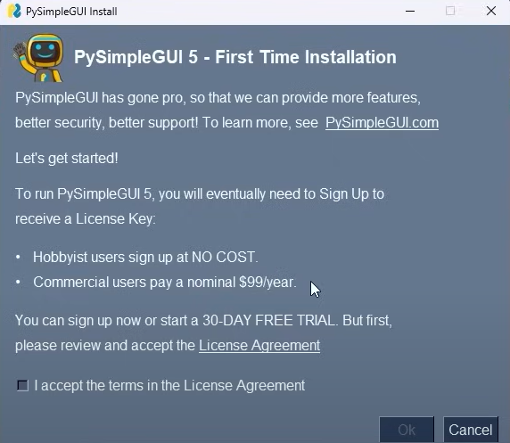
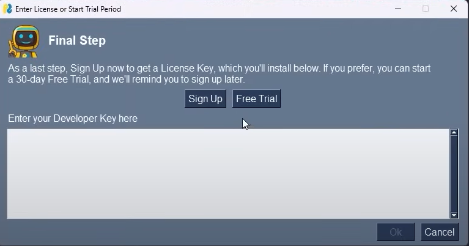
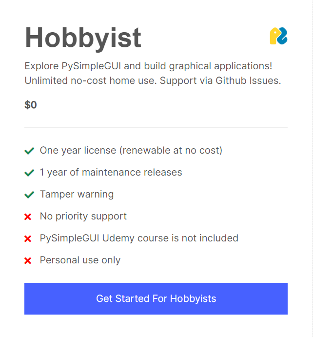
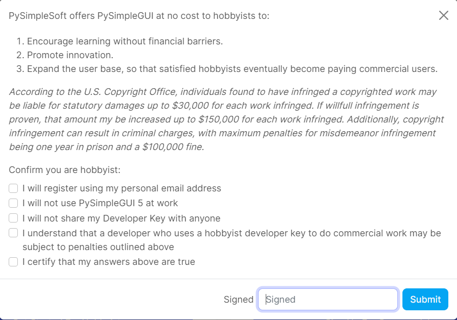
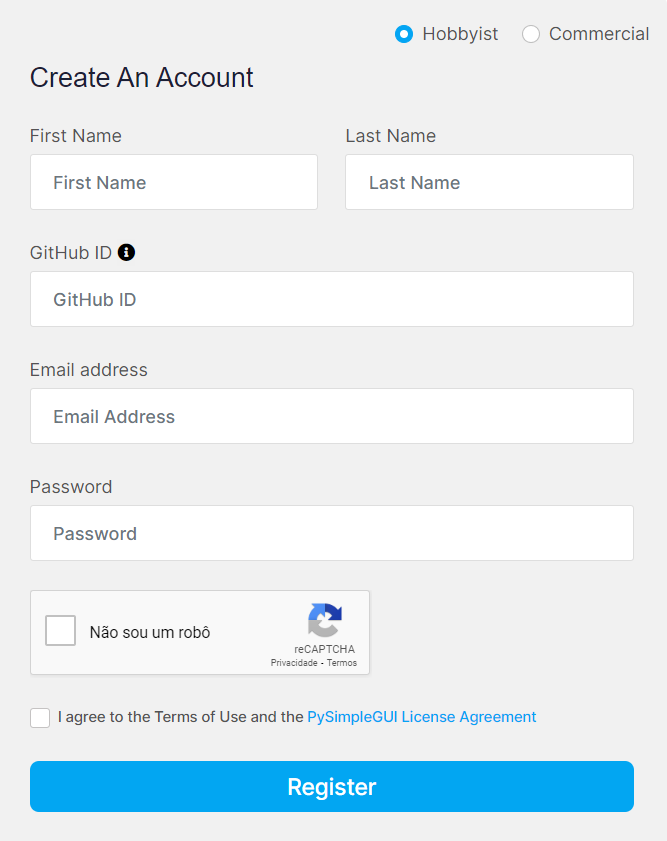
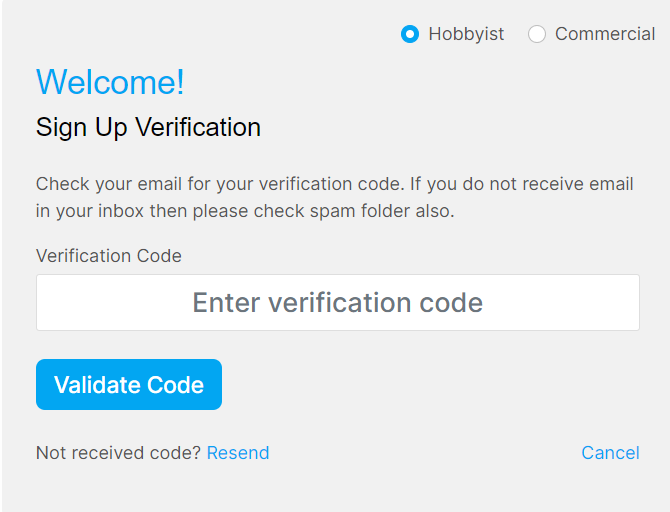
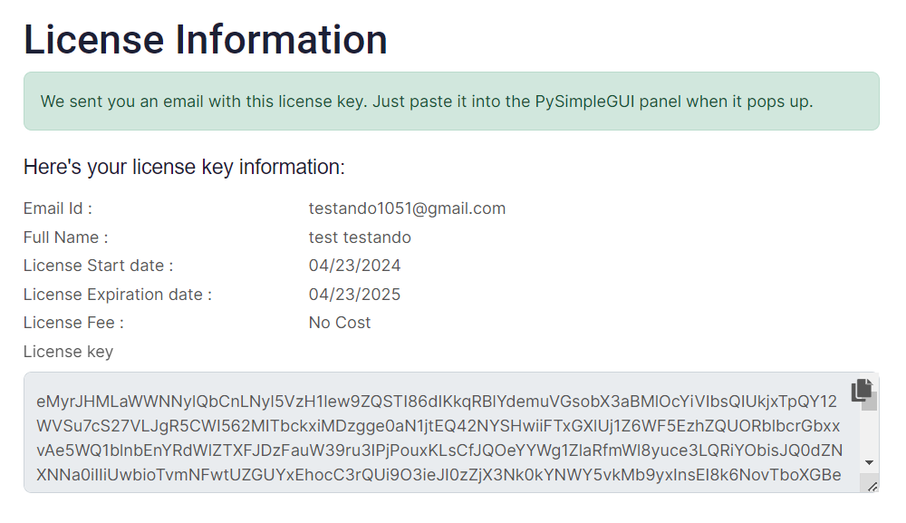
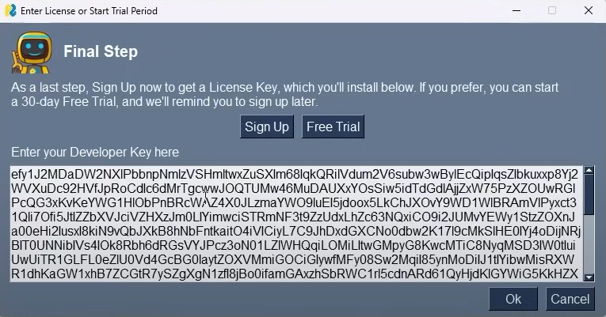
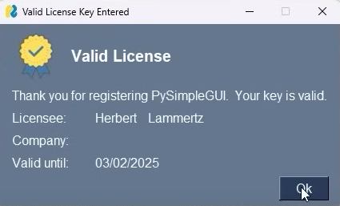

# Automação para Vitor H.

## Tópicos
- [Sobre](#sobre)
- [Atenção](#atenção)
  - [Verificação](#verificação)
  - [PySimpleGUI](#pysimplegui)
- [Utilização](#utilização)
  - [Executável](#executável)
  - [Código](#executável)
    - [Windows](#windows)
    - [Mac ou Linux](#mac-ou-linux)


## Sobre
Automação desenvolvida para o cliente, com a finalidade de extrair informações de um arquivos .xlsx e gerar seis arquivos .docx com textos padrões, variando conforme as informações extraidas.

Ao executar o projeto você irá buscar um arquivo **.xlsx** e a pasta onde deseja salvar o arquivo **.docx**, para fim de teste e bom funcionamento baixe a planilha **test.xlsx**

A versão disponibilizada aqui neste repositório público, não foi a versão entregue ao cliente, pois está versão está privada, aqui você encontrará o código base para conseguir testar no seu próprio ambiente.

Este código base, tem a finalidade de ajudar pessoas a entender como funciona as automações, para que consigam praticar e desenvolver, e claro, isso serve de incentivo para que outras pessoas se aventurem na área.

## Atenção
### Verificação
Para o caso de baixar o arquivo na pasta `dist`, ou gerar teu próprio executável, ele será verificado para ver se não é vírus, e passará na verificação, fique tranquilo, isso acontece devido a dependência `pyinstaller` utilizada no projeto, ela é responsável por gerar o arquivo executável.

### PySimpleGUI
No momento em que for utilizar o executável ou o código pela primeira vez, provavelmente aparecerá a seguinte tela. **ATENÇÃO: essa configuração será feita apenas da primeira vez.**

<div align="center" display="flex"> 
    <p>Marque o checkbox, e depois em <b>OK</b></p>
    
    <p>Clique em <b>Sign Up</b> ou <b>Register</b></p>
    
      <p>Clique em <b>Get Started For Hobbyists</b></p>
    
      <p>Marque todas as opções e insira seu email</p>
    
      <p>Crie a conta <b>O GitHub ID é opcional</b></p>
    
      <p>Vá ao email para ver o código de verificação</p>
    
      <p>Copie o código</p>
    
      <p>Insira o código copiado</p>
    
      <p>E está pronto pra uso</p>
    
</div>

## Utilização
### Executável
Para somente utilizar o projeto como teste, baixe o executável que está na pasta `dist`, e a planilha **test.xlsx**  e clicar duas vezes. 

### Código
Para executar o código é recomendado entrar no ambiente virtual. Segue abaixo tutorial de como fazer isso

#### Windows
Para executar o código o recomndado é fazer um ambiente virtual, faça isso com o seguinte comando:

`python -m venv venv`

Comando para entrar e sair do ambiente virtual com:

**Bash**:

```
source venv/Scripts/activate

deactivate
```

**PowerShell**:

```
.\venv\Scripts\Activate

deactivate
```

**CMD**:

```
.\venv\Scripts\activate

.\venv\Scripts\deactivate.bat
```

Instale as dependências:

```
pip install pandas

pip install python-docx

pip install PySimpleGUI

pip install tabulate

pip install pyinstaller

pip install openpyxl
```

Agora está pronto para executar e fazer suas próprias alterações.

Para rodar

`python app.py`

Para gerar o build, após o build ser gerado o executável será armazenado na pasta dist

`pyinstaller --onefile app.py`

### Mac ou Linux
Para executar o código, o recomndado é fazer um ambiente virtual, você fará isso apenas uma vez:

`python3 -m venv venv`

Comando para entrar e sair do ambiente:

```
source venv/Scripts/activate

deactivate
```

Instale as dependências:

```
pip3 install pandas

pip3 install python-docx

pip3 install PySimpleGUI

pip3 install tabulate

pip3 install pyinstaller

pip3 install openpyxl
```

Agora está pronto para executar e fazer suas próprias alterações.

Para rodar

`python3 app.py`

Para gerar o build, após o build ser gerado o executável será armazenado na pasta dist

`pyinstaller --onefile app.py`


